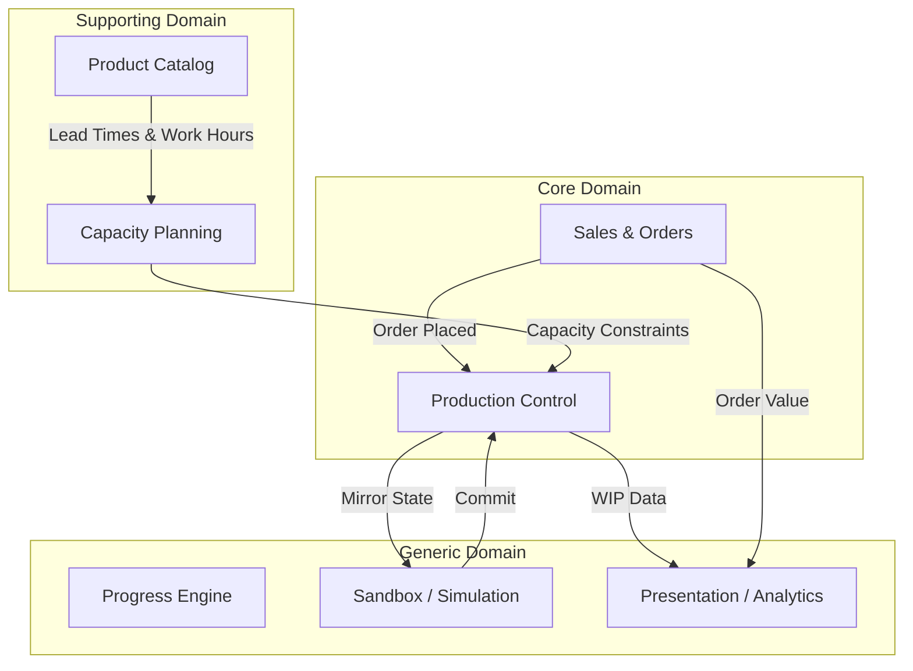
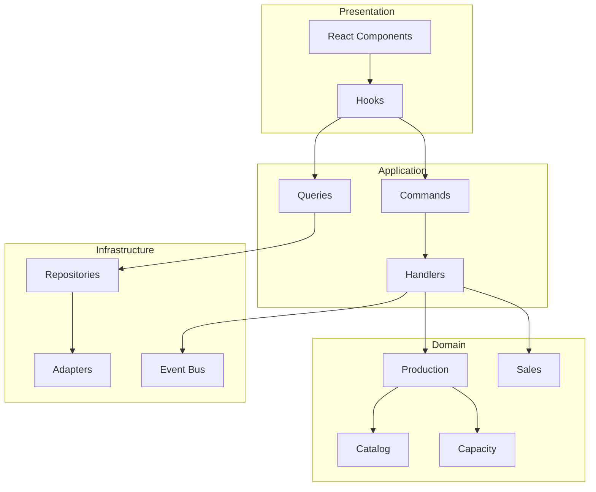
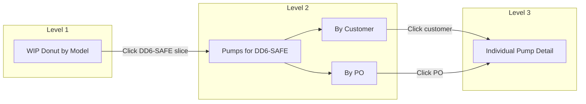

# PumpTracker vNext — DDD Blueprint

> **Version**: 1.0  
> **Date**: 2025-12-14  
> **Author**: Senior Software Architect (DDD Analysis)

---

## Executive Summary

This blueprint presents a Domain-Driven Design (DDD) architecture for PumpTracker vNext. After analyzing the existing codebase, the **PROJECT_REBUILD_PLAN.md** (Next.js + Drizzle direction), and domain artifacts, I recommend a **modular monolith** approach that:

1. **Preserves the core value** of the existing React-based SPA while introducing proper domain boundaries
2. **Enables the "Drill-Down" UX vision** through well-structured aggregates and read models
3. **Supports future database migration** (localStorage → Supabase/PostgreSQL) without disrupting domain logic
4. **Allows gradual extraction** of bounded contexts into companion services if needed

> [!IMPORTANT]
> The existing system has significant **tangled state in `store.ts`** (~546 lines). The primary architectural risk is the lack of separation between domain logic, persistence, and UI state. This blueprint addresses that systematically.

---

## A) Ubiquitous Language Glossary

| Term                       | Definition                                                                                                                       |
| -------------------------- | -------------------------------------------------------------------------------------------------------------------------------- |
| **Pump**                   | The manufactured asset. Each pump has a unique serial number and progresses through production stages.                           |
| **Serial Number**          | A 4-digit unique identifier assigned to each pump at creation.                                                                   |
| **Purchase Order (PO)**    | A customer's order that may contain multiple line items, each specifying a pump model and quantity.                              |
| **Line Item**              | A single entry on a PO specifying model, quantity, color, and promise date. Expands into individual Pump records.                |
| **Customer**               | The external party placing orders (e.g., "United Rentals", "Sunbelt Rentals").                                                   |
| **Pump Model**             | A catalog entry defining the pump type (e.g., "DD-6 SAFE"), its price, BOM (Bill of Materials), lead times, and work hours.      |
| **Stage**                  | A discrete step in the production workflow. Ordered: QUEUE → FABRICATION → POWDER COAT → ASSEMBLY → TESTING → SHIPPING → CLOSED. |
| **Work-In-Progress (WIP)** | Pumps currently in production stages (not QUEUE or CLOSED).                                                                      |
| **Lead Time**              | The expected number of business days to complete a production stage for a given model.                                           |
| **Work Hours**             | The man-hours required per stage per model, used for capacity calculations.                                                      |
| **Capacity**               | The weekly or daily throughput limit for a stage, derived from employee count, work hours, and efficiency.                       |
| **Promise Date**           | The date by which the customer expects delivery; drives priority and late order detection.                                       |
| **Scheduled Start/End**    | The projected start and completion dates calculated from lead times and capacity.                                                |
| **Priority**               | Urgency level: Low, Normal, High, Rush, Urgent. Affects scheduling order.                                                        |
| **Stage Move**             | The action of transitioning a pump from one stage to the next (the core production event).                                       |
| **Auto-Schedule**          | System action that assigns scheduled dates to unscheduled QUEUE pumps based on priority and capacity.                            |
| **Sandbox Mode**           | A simulation mode where changes are not persisted, allowing "what-if" scenario planning.                                         |
| **Milestone**              | A department-level goal with a deadline (part of the Progress Engine).                                                           |
| **MicroTask**              | A small, completable task linked to a milestone.                                                                                 |
| **Powder Coat Vendor**     | An external vendor providing powder coating services, with a weekly pump capacity.                                               |
| **Drill-Down**             | UX pattern where clicking a chart segment reveals the next level of detail within the same dataset.                              |
| **Drill-Through**          | UX pattern where clicking navigates to a different view/report for contextual information.                                       |

---

## B) Bounded Contexts & Context Map

### B.1 Identified Bounded Contexts



### B.2 Context Definitions

| Context                      | Responsibility                                                                                              | Data Ownership                                             |
| ---------------------------- | ----------------------------------------------------------------------------------------------------------- | ---------------------------------------------------------- |
| **Sales & Orders**           | Manages customers, purchase orders, and line items. Creates demand that flows into production.              | `Customer`, `PurchaseOrder`, `LineItem`                    |
| **Production Control**       | The **Core Domain**. Manages pump lifecycle through stages, handles stage transitions, enforces WIP limits. | `Pump`, `StageMove` (event log), `Stage`                   |
| **Product Catalog**          | Master data for pump models including specifications, BOM, lead times, and work hours. Read-mostly.         | `PumpModel`, `BOM`                                         |
| **Capacity Planning**        | Manages department staffing, work schedules, vendor capacity. Calculates available capacity.                | `CapacityConfig`, `DepartmentStaffing`, `PowderCoatVendor` |
| **Progress Engine**          | Gamified goal tracking for shop floor motivation. Milestones and micro-tasks.                               | `Milestone`, `MicroTask`                                   |
| **Sandbox / Simulation**     | Enables "what-if" scenarios by forking state. Generic infrastructure pattern.                               | Snapshot of Production + Orders state                      |
| **Presentation / Analytics** | Read models optimized for dashboards, charts, and drill-down exploration.                                   | Derived views (WIP by Model, Value by Customer, etc.)      |

### B.3 Context Map — Integration Styles

| Upstream           | Downstream         | Integration Style      | Notes                                                                                          |
| ------------------ | ------------------ | ---------------------- | ---------------------------------------------------------------------------------------------- |
| Sales & Orders     | Production Control | **Customer-Supplier**  | When a PO is placed, Production Control receives `OrderPlaced` event and creates Pump records. |
| Product Catalog    | Production Control | **Conformist**         | Production Control uses the catalog's lead times and work hours as-is.                         |
| Product Catalog    | Capacity Planning  | **Conformist**         | Capacity Planning reads work hour estimates from catalog.                                      |
| Capacity Planning  | Production Control | **Customer-Supplier**  | Production Control queries capacity before scheduling.                                         |
| Production Control | Presentation       | **Published Language** | Production Control publishes read-optimized projections for charts.                            |
| Production Control | Sandbox            | **Shared Kernel**      | Sandbox forks the full Production state for simulation.                                        |

### B.4 Monolith vs Microservices Recommendation

> [!TIP] > **Recommendation: Modular Monolith**

**Justification:**

1. **Team Size**: Appears to be a small team. Microservices add operational complexity.
2. **Deployment Simplicity**: Single deployable unit (SPA + optional backend).
3. **Data Locality**: All data currently in localStorage or single Supabase schema.
4. **Transaction Boundaries**: Stage moves, scheduling, and order creation benefit from in-process transactions.

**Future Extraction Candidates** (if scale demands):

- **Product Catalog** → Could become a separate admin tool or headless CMS.
- **Analytics/Reporting** → Could be extracted to a dedicated BI service.

---

## C) Domain Models per Context

### C.1 Production Control (Core Domain)

#### Entities

| Entity | Identity                               | Attributes                                                                                                                          |
| ------ | -------------------------------------- | ----------------------------------------------------------------------------------------------------------------------------------- |
| `Pump` | `id` (UUID), `serial` (unique 4-digit) | `model`, `stage`, `priority`, `powder_color`, `value`, `scheduledStart`, `scheduledEnd`, `promiseDate`, `last_update`, `work_hours` |

#### Value Objects

| Value Object     | Properties                                                                 | Notes                                |
| ---------------- | -------------------------------------------------------------------------- | ------------------------------------ |
| `Stage`          | enum: QUEUE, FABRICATION, POWDER COAT, ASSEMBLY, TESTING, SHIPPING, CLOSED | Ordered; defines valid transitions.  |
| `Priority`       | enum: Low, Normal, High, Rush, Urgent                                      | Affects scheduling order.            |
| `ScheduleWindow` | `startISO`, `endISO`                                                       | Immutable once calculated.           |
| `StageBlock`     | `stage`, `start`, `end`, `days`, `pump`                                    | Represents a pump's time in a stage. |

#### Aggregates

```
┌─────────────────────────────────────────────────────────────┐
│                    PUMP AGGREGATE                            │
│  ┌───────────────────────────────────────────────────────┐  │
│  │  Pump (Aggregate Root)                                 │  │
│  │  - id, serial, model, stage, priority                  │  │
│  │  - scheduledStart, scheduledEnd, promiseDate           │  │
│  │  - value, powder_color, last_update, work_hours        │  │
│  └───────────────────────────────────────────────────────┘  │
│                                                              │
│  Invariants:                                                 │
│  1. Stage transitions must follow the ordered sequence.     │
│  2. Serial number is immutable after creation.              │
│  3. Moving a pump updates last_update timestamp.            │
│  4. CLOSED pumps cannot be moved to earlier stages.         │
└─────────────────────────────────────────────────────────────┘
```

#### Domain Events

| Event                 | Trigger                  | Payload                                                 |
| --------------------- | ------------------------ | ------------------------------------------------------- |
| `PumpCreated`         | New pump added (from PO) | `{ pumpId, serial, model, customer, po, stage: QUEUE }` |
| `PumpStageMoved`      | Stage transition         | `{ pumpId, fromStage, toStage, timestamp }`             |
| `PumpScheduled`       | Schedule assigned        | `{ pumpId, scheduledStart, scheduledEnd }`              |
| `PumpScheduleCleared` | Schedule removed         | `{ pumpId }`                                            |
| `PumpUpdated`         | Any attribute change     | `{ pumpId, changes }`                                   |

#### Invariants

1. **Stage Order**: Pumps must progress QUEUE → FABRICATION → POWDER COAT → ASSEMBLY → TESTING → SHIPPING → CLOSED. No skipping.
2. **Unique Serial**: No two pumps may share the same serial number.
3. **WIP Limits**: A stage may have a WIP limit (e.g., FABRICATION max 8). Enforced at UI/policy level, not strictly by aggregate.
4. **Immutable After Close**: Once CLOSED, a pump cannot be re-opened (business rule to confirm).

---

### C.2 Sales & Orders

#### Entities

| Entity          | Identity                           | Attributes                                                           |
| --------------- | ---------------------------------- | -------------------------------------------------------------------- |
| `PurchaseOrder` | `po` (string, e.g., "PO2025-0001") | `customer`, `dateReceived`, `promiseDate`, `lines[]`                 |
| `LineItem`      | composite: `po` + index            | `model`, `quantity`, `color`, `promiseDate`, `valueEach`, `priority` |

> [!NOTE]
> In the current system, PurchaseOrder is **implicit** — it exists as the `po` string on each Pump. For vNext, explicit PO modeling enables:
>
> - PO-level views and drill-down
> - Order status tracking (partially shipped, complete)
> - Customer analytics

#### Aggregates

```
┌─────────────────────────────────────────────────────────────┐
│                PURCHASE ORDER AGGREGATE                      │
│  ┌───────────────────────────────────────────────────────┐  │
│  │  PurchaseOrder (Aggregate Root)                        │  │
│  │  - po, customer, dateReceived, promiseDate             │  │
│  ├───────────────────────────────────────────────────────┤  │
│  │  LineItem[]                                            │  │
│  │  - model, quantity, color, promiseDate, valueEach      │  │
│  └───────────────────────────────────────────────────────┘  │
│                                                              │
│  Invariants:                                                 │
│  1. PO number is unique.                                     │
│  2. At least one line item required.                         │
│  3. Total value = sum(line.quantity * line.valueEach).       │
└─────────────────────────────────────────────────────────────┘
```

#### Domain Events

| Event            | Trigger                    | Payload                                  |
| ---------------- | -------------------------- | ---------------------------------------- |
| `OrderPlaced`    | New PO created             | `{ po, customer, lines[], promiseDate }` |
| `OrderFulfilled` | All pumps on PO are CLOSED | `{ po, completionDate }`                 |

---

### C.3 Product Catalog (Supporting)

#### Entities

| Entity      | Identity                            | Attributes                                                |
| ----------- | ----------------------------------- | --------------------------------------------------------- |
| `PumpModel` | `model` (string, e.g., "DD-6 SAFE") | `description`, `price`, `bom`, `lead_times`, `work_hours` |

#### Value Objects

| Value Object      | Properties                                                        |
| ----------------- | ----------------------------------------------------------------- |
| `BillOfMaterials` | `engine`, `gearbox`, `control_panel`                              |
| `LeadTimes`       | `fabrication`, `powder_coat`, `assembly`, `testing`, `total_days` |
| `WorkHours`       | `fabrication`, `assembly`, `testing`, `shipping`                  |

#### Invariants

1. Model code is unique.
2. Lead times must be positive numbers.
3. Price may be null (fallback logic applies).

---

### C.4 Capacity Planning (Supporting)

#### Entities

| Entity             | Identity                                           | Attributes                                                     |
| ------------------ | -------------------------------------------------- | -------------------------------------------------------------- |
| `DepartmentConfig` | `stage` (FABRICATION, ASSEMBLY, TESTING, SHIPPING) | `employeeCount`, `workDayHours`, `efficiency`, `dailyManHours` |
| `PowderCoatVendor` | `id`                                               | `name`, `maxPumpsPerWeek`                                      |

#### Aggregates

```
┌─────────────────────────────────────────────────────────────┐
│              CAPACITY CONFIG AGGREGATE                       │
│  ┌───────────────────────────────────────────────────────┐  │
│  │  CapacityConfig (Aggregate Root)                       │  │
│  │  - fabrication: DepartmentConfig                       │  │
│  │  - assembly: DepartmentConfig                          │  │
│  │  - testing: DepartmentConfig                           │  │
│  │  - shipping: DepartmentConfig                          │  │
│  │  - powderCoat: { vendors: PowderCoatVendor[] }         │  │
│  └───────────────────────────────────────────────────────┘  │
│                                                              │
│  Reactive Logic:                                             │
│  - employeeCount change → recalculate dailyManHours          │
│  - efficiency change → recalculate dailyManHours             │
│  - dailyManHours direct change → back-calculate efficiency   │
└─────────────────────────────────────────────────────────────┘
```

---

### C.5 Progress Engine (Generic)

#### Entities

| Entity      | Identity    | Attributes                                                          |
| ----------- | ----------- | ------------------------------------------------------------------- |
| `Milestone` | `id` (UUID) | `title`, `department`, `deadline`, `createdAt`                      |
| `MicroTask` | `id` (UUID) | `milestoneId`, `description`, `isComplete`, `completedAt`, `weight` |

#### Invariants

1. MicroTask must belong to an existing Milestone.
2. Deleting a Milestone cascades to its MicroTasks.

---

## D) Use-Case Catalog

### D.1 User Goals → Commands → Events → Read Models

| User Goal                        | Actor             | Command                                   | Events                                        | Read Model Update                                |
| -------------------------------- | ----------------- | ----------------------------------------- | --------------------------------------------- | ------------------------------------------------ |
| **Place a new order**            | Sales User        | `PlaceOrder(po, customer, lines[])`       | `OrderPlaced`, `PumpCreated` (×N)             | Orders list, Backlog count, WIP totals           |
| **Move pump to next stage**      | Shop Floor Worker | `MovePumpStage(pumpId, toStage)`          | `PumpStageMoved`                              | Kanban columns, Stage WIP counts, Timeline       |
| **Schedule a pump**              | Scheduler         | `SchedulePump(pumpId, startDate)`         | `PumpScheduled`                               | Calendar grid, Backlog dock                      |
| **Auto-schedule backlog**        | Scheduler         | `AutoSchedule()`                          | `PumpScheduled` (×N)                          | Calendar grid, Backlog cleared                   |
| **Clear pump schedule**          | Scheduler         | `ClearSchedule(pumpId)`                   | `PumpScheduleCleared`                         | Pump returns to backlog                          |
| **Update pump details**          | Admin             | `UpdatePump(pumpId, patch)`               | `PumpUpdated`                                 | Pump detail modal, Kanban card                   |
| **Drill down on WIP by Model**   | Analyst           | (Read operation)                          | —                                             | Show pumps filtered by model, then by customer   |
| **Drill down on Value by Model** | Analyst           | (Read operation)                          | —                                             | Show orders/customers contributing to that value |
| **Enter sandbox mode**           | Planner           | `EnterSandbox()`                          | —                                             | UI displays sandbox indicator                    |
| **Commit sandbox changes**       | Planner           | `CommitSandbox()`                         | Writes to real store                          | Sandbox dismissed, changes persisted             |
| **Discard sandbox**              | Planner           | `ExitSandbox()`                           | —                                             | State reverts to pre-sandbox snapshot            |
| **Adjust department staffing**   | Admin             | `UpdateDepartmentStaffing(stage, config)` | —                                             | Capacity recalculated                            |
| **Create milestone**             | Manager           | `AddMilestone(milestone)`                 | `MilestoneCreated`                            | Kiosk progress widget                            |
| **Toggle micro-task**            | Worker            | `ToggleMicroTask(taskId)`                 | `MicroTaskCompleted` / `MicroTaskUncompleted` | Progress bar update                              |

### D.2 Read Models for Dashboard Drill-Down

| Read Model               | Source Aggregates                                   | Purpose                                |
| ------------------------ | --------------------------------------------------- | -------------------------------------- |
| `WipByStage`             | Pump (grouped by stage)                             | Bar/donut chart of WIP counts          |
| `WipByModel`             | Pump (grouped by model)                             | Donut chart; first level of drill-down |
| `WipByModelByCustomer`   | Pump (grouped by model, then customer)              | Second level of drill-down             |
| `WipByModelByPO`         | Pump (grouped by model, then PO)                    | Alternate second level                 |
| `ValueByModel`           | Pump (sum value grouped by model)                   | Treemap; first level                   |
| `ValueByModelByCustomer` | Pump (sum value by model, then customer)            | Second level of drill-down             |
| `LateOrders`             | Pump (where promiseDate < today && stage != CLOSED) | Late order tracking                    |
| `CapacityByDept`         | CapacityConfig + Pump (WIP counts)                  | Utilization chart                      |
| `ScheduledTimeline`      | Pump (with scheduledStart) + buildStageTimeline     | Calendar grid                          |

---

## E) Architecture Outline

### E.1 Module Structure (Modular Monolith)

```
src/
├── domain/
│   ├── production/           # Core: Pump aggregate, stage logic
│   │   ├── entities/
│   │   │   └── Pump.ts
│   │   ├── value-objects/
│   │   │   ├── Stage.ts
│   │   │   ├── Priority.ts
│   │   │   └── ScheduleWindow.ts
│   │   ├── events/
│   │   │   ├── PumpCreated.ts
│   │   │   ├── PumpStageMoved.ts
│   │   │   └── PumpScheduled.ts
│   │   ├── services/
│   │   │   ├── SchedulingService.ts
│   │   │   └── StageTransitionService.ts
│   │   └── repository.ts     # Interface
│   │
│   ├── sales/                # Sales & Orders context
│   │   ├── entities/
│   │   │   └── PurchaseOrder.ts
│   │   ├── events/
│   │   │   └── OrderPlaced.ts
│   │   └── repository.ts
│   │
│   ├── catalog/              # Product Catalog context
│   │   ├── entities/
│   │   │   └── PumpModel.ts
│   │   └── repository.ts     # Read-only
│   │
│   └── capacity/             # Capacity Planning context
│       ├── entities/
│       │   └── CapacityConfig.ts
│       └── services/
│           └── CapacityCalculator.ts
│
├── application/              # Use cases / application services
│   ├── commands/
│   │   ├── PlaceOrderCommand.ts
│   │   ├── MovePumpStageCommand.ts
│   │   ├── SchedulePumpCommand.ts
│   │   └── AutoScheduleCommand.ts
│   ├── queries/
│   │   ├── GetWipByModelQuery.ts
│   │   ├── GetValueByModelQuery.ts
│   │   └── GetScheduledPumpsQuery.ts
│   └── handlers/
│       └── CommandHandlers.ts
│
├── infrastructure/
│   ├── persistence/
│   │   ├── adapters/
│   │   │   ├── LocalStorageAdapter.ts
│   │   │   ├── SupabaseAdapter.ts
│   │   │   └── DrizzleAdapter.ts    # Future
│   │   ├── repositories/
│   │   │   ├── PumpRepository.ts
│   │   │   └── OrderRepository.ts
│   │   └── migrations/
│   ├── eventBus/                   # Simple in-process event bus
│   │   └── EventBus.ts
│   └── sandboxing/
│       └── SandboxManager.ts
│
├── presentation/
│   ├── components/
│   │   ├── dashboard/
│   │   │   ├── charts/              # Chart components
│   │   │   ├── DrillDownContainer.tsx
│   │   │   └── TopicNavigator.tsx
│   │   ├── kanban/
│   │   ├── scheduling/
│   │   ├── kiosk/
│   │   └── ui/
│   ├── hooks/
│   │   ├── usePumps.ts
│   │   ├── useWipData.ts
│   │   └── useDrillDown.ts
│   └── pages/
│
├── config/
│   └── index.ts
│
└── store/                    # Thin Zustand layer (UI state only)
    └── uiStore.ts            # Filters, collapsed states, UI toggles
```

### E.2 Module Boundaries & Dependencies



**Dependency Rules:**

- `domain/*` has **no imports** from `infrastructure/*` or `presentation/*`
- `application/*` imports from `domain/*`
- `infrastructure/*` imports from `domain/*` (implements interfaces)
- `presentation/*` imports from `application/*` (via hooks)

### E.3 API Boundaries

For the **modular monolith**, APIs are in-process function calls via hooks and application services. If migrating to Next.js App Router with server components:

| Surface                     | API Style                              | Notes                                  |
| --------------------------- | -------------------------------------- | -------------------------------------- |
| Queries (Dashboard, Kanban) | React Server Components + `use server` | Fetch data on server, render HTML      |
| Commands (Move, Schedule)   | Server Actions                         | POST-like mutations with optimistic UI |
| Real-time (Kiosk)           | Supabase Realtime or polling           | For multi-user sync                    |

### E.4 Data Boundaries

| Context    | Local Ownership                 | Integration Data                               |
| ---------- | ------------------------------- | ---------------------------------------------- |
| Production | `pumps` table/collection        | Reads from `catalog.models`, `capacity.config` |
| Sales      | `purchase_orders`, `line_items` | Writes to Production via events                |
| Catalog    | `pump_models`                   | Read-only from Production/Capacity             |
| Capacity   | `capacity_config`               | Read by Production during scheduling           |
| Progress   | `milestones`, `micro_tasks`     | Independent; linked by `org_id`                |

### E.5 Integration Patterns

1. **Event-Driven (In-Process)**:

   - `OrderPlaced` → Production Control creates Pump records
   - `PumpStageMoved` → Analytics updates read models
   - Future: Event sourcing for audit trail (the "Ledger" concept from PROJECT_REBUILD_PLAN)

2. **Query-Based (Read Models)**:

   - Dashboard queries optimized views (WipByModel, ValueByCustomer)
   - Read models can be materialized views or computed on-demand

3. **Sandbox as State Fork**:
   - Snapshot current state → operate in memory → commit or discard
   - Persistence adapter checks `isSandbox` flag before writing

### E.6 Migration Strategy

#### Phase 1: Domain Extraction (2-3 weeks)

- Extract Pump aggregate logic from `store.ts` into `domain/production/`
- Create explicit PurchaseOrder entity
- Define repository interfaces
- Keep Zustand for UI state only

#### Phase 2: Add Event Bus (1 week)

- Simple in-process event bus
- Emit domain events on mutations
- Update read models reactively

#### Phase 3: Drill-Down Read Models (2 weeks)

- Build dedicated query services for dashboard charts
- Implement `DrillDownContainer` with breadcrumb navigation
- Topic Navigator with favorites

#### Phase 4: Optional Backend Migration (If chose Next.js + Drizzle)

- Create Drizzle schema matching domain models
- Implement `DrizzleAdapter` conforming to repository interfaces
- Server Actions for commands
- Server Components for queries

---

## F) Risks & Gotchas + Refactor Priorities

### F.1 Identified Risks in Existing System

| Risk                          | Severity  | Evidence                                                                   | Mitigation                                                                   |
| ----------------------------- | --------- | -------------------------------------------------------------------------- | ---------------------------------------------------------------------------- |
| **Monolithic Store**          | 🔴 High   | `store.ts` is 546 lines with mixed domain logic, persistence, and UI state | Extract domain logic into `domain/` modules; keep store thin                 |
| **Implicit PO Model**         | 🟡 Medium | PO exists only as a string on Pump; no aggregate                           | Explicit `PurchaseOrder` entity enables PO-level analytics and drill-through |
| **No Event History**          | 🟡 Medium | Stage moves update in place; no audit trail                                | Introduce `PumpStageMoved` events; optionally store in ledger table          |
| **Sandbox Persistence Risk**  | 🟡 Medium | Relies on `isSandbox` flag check in adapter                                | Formalize via `SandboxManager` with explicit lock                            |
| **Capacity Logic in Store**   | 🟡 Medium | `autoSchedule` embeds complex capacity logic                               | Extract to `SchedulingService` in domain                                     |
| **Lead Time Lookup Coupling** | 🟠 Low    | `getModelLeadTimes` pulls from seed data directly                          | Inject Catalog repository; separate concerns                                 |
| **UI State Persistence**      | 🟠 Low    | Filters, collapsed states persisted in Zustand                             | Fine for now; could separate if becomes complex                              |

### F.2 Refactor Priorities (Ordered)

1. **Domain Layer Extraction**

   - Create `domain/production/entities/Pump.ts` with stage transition methods
   - Create `domain/production/services/SchedulingService.ts`
   - Define repository interface `IPumpRepository`

2. **Explicit PurchaseOrder Aggregate**

   - Model PO with line items
   - Enable PO-level queries for drill-down

3. **Event Infrastructure**

   - Add `EventBus` for domain events
   - Emit events on stage moves, scheduling actions
   - Foundation for future Ledger/audit log

4. **Read Model Services**

   - `WipQueryService` for WIP by stage/model/customer
   - `ValueQueryService` for value analytics
   - Decouples presentation from domain aggregates

5. **Drill-Down UX Components**
   - `DrillDownContainer` managing navigation state

````
   - Breadcrumb component
   - Topic Navigator with pin-to-favorites

---

## Confirmed Decisions

| Question | Decision | Impact |
|----------|----------|--------|
| **Stage Transitions** | No skipping. Pumps must follow the full sequence: QUEUE → FABRICATION → POWDER COAT → ASSEMBLY → TESTING → SHIPPING → CLOSED | Enforced as invariant in Pump aggregate |
| **Closed Pumps** | CLOSED is terminal. Cannot be re-opened. | Enforced as invariant |
| **Multi-Tenancy** | Single organization only. Remove `org_id` from Milestone (unnecessary clutter). | Simplifies all entity models |
| **Tech Stack** | Stay with **React SPA + Supabase**. Only migrate to Next.js if it solves problems that React cannot. | Modular monolith on current stack |
| **Historical Ledger** | **Required**. Need full audit trail for LLM-assisted queries. | Implement `stage_moves` table |

---

## Ledger Design for Historical Queries

At ~300 pumps/year with ~5-6 stage moves per pump, the ledger will grow by ~1,500-2,000 rows/year — trivially queryable for decades.

### `stage_moves` Table Schema

```sql
CREATE TABLE stage_moves (
  id UUID PRIMARY KEY DEFAULT gen_random_uuid(),
  pump_id UUID NOT NULL REFERENCES pumps(id),
  from_stage TEXT,                    -- NULL for initial creation
  to_stage TEXT NOT NULL,
  moved_at TIMESTAMPTZ NOT NULL DEFAULT now(),
  moved_by TEXT,                      -- Optional: user who made the move

  -- Denormalized for query efficiency (avoids JOINs)
  pump_serial INTEGER NOT NULL,
  pump_model TEXT NOT NULL,
  customer TEXT NOT NULL,
  po TEXT NOT NULL,
  powder_coat_vendor TEXT             -- Populated when to_stage = 'POWDER COAT'
);

CREATE INDEX idx_stage_moves_pump ON stage_moves(pump_id);
CREATE INDEX idx_stage_moves_stage ON stage_moves(to_stage);
CREATE INDEX idx_stage_moves_date ON stage_moves(moved_at);
CREATE INDEX idx_stage_moves_customer ON stage_moves(customer);
CREATE INDEX idx_stage_moves_model ON stage_moves(pump_model);
````

### Example Queries (LLM-Friendly)

| Question                                                      | SQL                                                                                                                                                                                                                        |
| ------------------------------------------------------------- | -------------------------------------------------------------------------------------------------------------------------------------------------------------------------------------------------------------------------- |
| "How many DD6-SAFE did we ship to United Rentals in Q1 2025?" | `SELECT COUNT(DISTINCT pump_id) FROM stage_moves WHERE pump_model = 'DD6-SAFE' AND customer = 'United Rentals' AND to_stage = 'SHIPPING' AND moved_at BETWEEN '2025-01-01' AND '2025-03-31'`                               |
| "Which powder coat vendor did the least work this year?"      | `SELECT powder_coat_vendor, COUNT(*) FROM stage_moves WHERE to_stage = 'POWDER COAT' AND moved_at >= '2025-01-01' GROUP BY powder_coat_vendor ORDER BY count ASC LIMIT 1`                                                  |
| "When did serial #12345 pass through testing?"                | `SELECT moved_at FROM stage_moves WHERE pump_serial = 12345 AND to_stage = 'TESTING'`                                                                                                                                      |
| "Which model did Customer B purchase most last year?"         | `SELECT pump_model, COUNT(DISTINCT pump_id) as cnt FROM stage_moves WHERE customer = 'Customer B' AND from_stage IS NULL AND moved_at BETWEEN '2024-01-01' AND '2024-12-31' GROUP BY pump_model ORDER BY cnt DESC LIMIT 1` |

### Domain Event → Ledger Entry

Every `PumpStageMoved` event writes to the ledger:

```typescript
// When moveStage(pumpId, toStage) is called:
async function recordStageMove(
  pump: Pump,
  fromStage: Stage | null,
  toStage: Stage
) {
  await supabase.from("stage_moves").insert({
    pump_id: pump.id,
    from_stage: fromStage,
    to_stage: toStage,
    pump_serial: pump.serial,
    pump_model: pump.model,
    customer: pump.customer,
    po: pump.po,
    powder_coat_vendor:
      toStage === "POWDER COAT" ? getAssignedVendor(pump) : null,
  });
}
```

> [!TIP] > **Denormalization is intentional.** At this scale, storage is cheap and query simplicity is paramount. Denormalizing `pump_serial`, `pump_model`, `customer`, and `po` into each row means most queries can be answered from the ledger alone without JOINs.

---

## Appendix: Diagram of Drill-Down Data Flow



---

## Next Steps

1. **Review this blueprint** and answer clarifying questions
2. **Approve bounded context boundaries** and integration styles
3. **Prioritize migration phases** based on business value
4. **Begin Phase 1**: Domain layer extraction parallel to existing code
